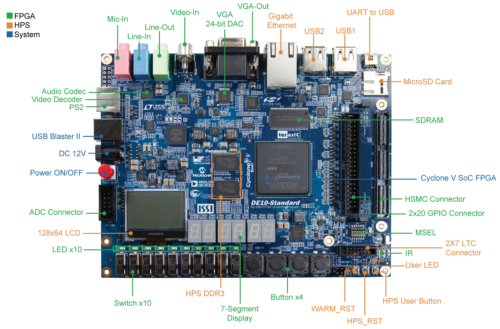
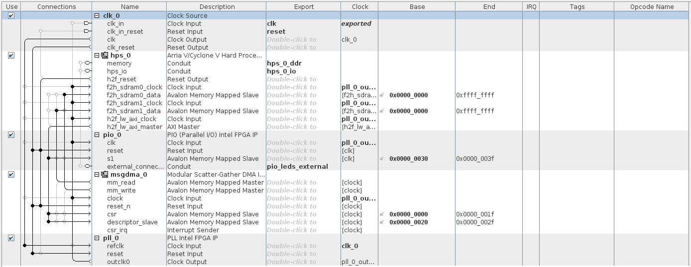
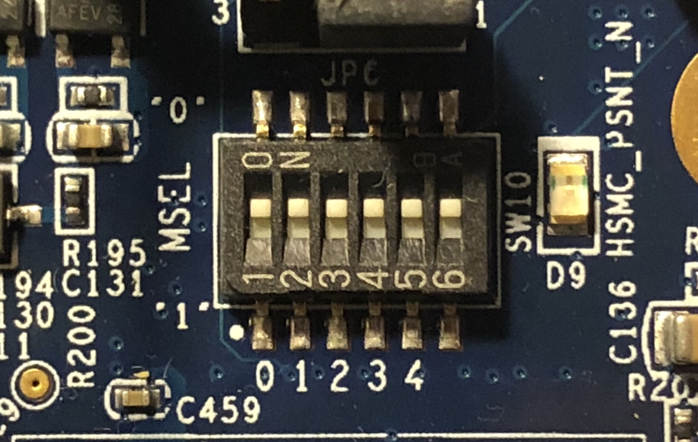

# Terasic DE10-Standard boilerplate

This repository contains the boilerplate to develop projects using the Terasic DE10-Standard board.



## Content of this folder

* `./doc/` contains documentation about this boilerplate.
* `./hw/` contains the files for the hardware component of the project.
* `./sdcard/` contains the files to be written to the SD card.
* `./sw/` contains the files for the software component of the project.
* `./create_linux_system.sh` is a script that automatically partitions the SD card and writes the required files to configure the FPGA at boot time and run the Linux operating system.

## Requisites

1. Host PC running Windows or Linux (preferably Linux);
2. Terasic DE10-Standard board;
3. Micro-SD card with at least 1 GB.
4. Intel Quartus Prime 18.1 or higher **(both Lite and Standard versions are supported)**.

## Getting started

For exemplification purposes, this boilerplate includes a small system featuring a loopback DMA engine that streams a section of the DDR3 memory and writes back the data to another section within the memory. There is also a simple application written in C code to be executed over Linux running on the board that controls and synchronizes the DMA engine. The following subsections will guide you through the deployment process of the example project. For detailed explanations about the implementation refer to the `/doc/` directory within this repository.

### Generating the project files and writing the micro-SD card.

1. Make sure that the Intel FPGA tools are in your `$PATH`. For example, in my case, I source the following script.
```
VERSION=18.1
INSTALL_DIR=/opt/intelFPGA

# quartus
export PATH=$INSTALL_DIR/$VERSION/quartus/bin:$PATH
export LM_LICENSE_FILE=<port@server>

# arm ds
SOCEDS_DEST_ROOT=$INSTALL_DIR/$VERSION/embedded
QUARTUS_ROOTDIR=$INSTALL_DIR/$VERSION/quartus
source $INSTALL_DIR/$VERSION/embedded/env.sh
```
2. Launch an embedded command shell. For doing so, execute the script `<intelFPGA install dir>/embedded/embedded_command_shell.sh`.
3. Launch Intel Quartus Prime and open the example project by selecting *File*, *Open Project*. Select the file `./hw/quartus/project.qpf`.
4. Launch the Platform Designer tool by selecting *Tools*, *Platform Designer* and open the file `./hw/quartus/soc_system.qsys`. You should see the layout bellow.

5. Click on *Generate HDL*.
    1. Select *VHDL* for *Create HDL design files for synthesis*.
    2. Uncheck the *Create block symbol file (.bsf)* checkbox.
    3. Click on *Generate*.
6. Save the design and exit the Platform Designer. If asked if you want to generate the design, select *No*, as it was already done in the previous step.
7. On Quartus Prime, start the *Analysis and Synthesis*.
8. Go to *Tools*, *Tcl Scripts...*
    1. Execute the script named *hps_sdram_p0_pin_assignments.tcl* under *Project*, *soc_system*, *synthesis*, *submodules*.
9. Select *Start Compilation* on Quartus Prime and wait until it finishes. If you followed correctly all the steps, you should get no compilation errors. You can now close Quartus Prime.
10. On the embedded command shell, run the following command to generate the Raw Binary File required to program the FPGA at boot time when booting from the micro-SD card.
```
quartus_cpf -c \
    hw/quartus/project.sof \
    sdcard/fat32/socfpga.rbf
```
11. On the embedded command shell, run the following command to generate the header file required for programmatically access the peripherals on the FPGA fabric from the HPS.
```
sopc-create-header-files \
    hw/quartus/soc_system.sopcinfo \
    --single sw/hps/application/hps_soc_system.h \
    --module hps_0
```
12. Connect the micro-SD card to your computer using a card reader and find out the name assigned by the operating system. When using Linux, this information can be obtained through the command `dmesg`. For instance, in my case, I obtained the following output, therefore my micro-SD card identifier is `/dev/sde`.
```
[ 6474.308896] sd 4:0:0:0: [sde] Attached SCSI removable disk
[ 6474.028186] EXT4-fs (sde2): mounting ext3 file system using the ext4 subsystem
[ 6474.198483] EXT4-fs (sde2): mounted filesystem with ordered data mode. Opts: (null)
```
13. Write the files to the micro-SD card by executing the script `./create_linux_system.sh` followed by the identifier found in step 6 (on the example below, `/dev/sde` is used). **Note that this script requires root privileges. Make sure that the micro-SD card identifier is correct. Indicating a wrong identifier may erase your hard drive permanently. All the data stored in the micro-SD card will be permanently erased.**
```
sudo ./create_linux_system.sh /dev/sde
```
14. Remove the micro-SD card from your computer and plug it to the board.
15. Set the *MSEL* switches to `000000`, as shown below.

16. Connect the board to the computer through the UART interface (black cable in the upper right corner), to an internet router through the ethernet interface (yellow cable), and to the power source using the power cord.

13. Turn on the power switch on the board and run `dmesg` to find the name of the UART interface (in my case, I have got `/dev/ttyUSB0`). Open a serial console to communicate with the board. In Linux, the `screen` command can be used.
```
sudo screen /dev/ttyUSB0 115200
```
    1. If you get an error during boot, try cold rebooting the board. When you see the text *Hit any key to stop autoboot:*, press enter and run the following commands.
    ```
    env default -a
    saveenv
    ```
    2. Cold reboot the board.
16. You have now a fully operational Linux operating system running on the board. Log in using the username `root` and password `1234`. Check that the board is connected to the internet **(very important, since you will use ssh for develoment purposes)** by running the command `ping 8.8.8.8`.

### Running the Linux application

1. Launch the DS-5 Development Studio through the command `eclipse`. Select any directory of your liking as the workspace.
2. Create a new C project by selecting *File*, *New*, *C Project*.
    1. Use *hps_linux* as the project name.
    2. Disable the *Use default location* checkbox.
    3. Set `./sw/hps/application` as the target location for the project.
    4. Select *Executable*, *Empty Project* as the project type.
    5. Choose *GCC 4.x [arm-linux-gnueabihf] \(DS-5 built-in)* as the toolchain.
    6. Press the *Finish* button. If you are asked if you want to override a previous configuration, go ahead and press *Ok*.
3. For the toolchain to successfully compile the project, some configurations have to be done and some files and libraries have to be linked.
    1. Righ-click on *hps_linux* under *Project Explorer* and select *Properties*.
    2. Under *C/C++ Build*, *Settings*, *GCC C Compiler 4 [arm-linux-gnueabihf]*, *Dialect*, select *ISO C99 (-std=c99)* as language standard.
    3. Under *C/C++ Build*, *Settings*, *GCC C Compiler 4 [arm-linux-gnueabihf]*, *Preprocessor*, add *soc_cv_av* to the *Defined symbols (-D)* list.
    4. Under *C/C++ Build*, *Settings*, *GCC C Compiler 4 [arm-linux-gnueabihf]*, *Includes*, add the following paths to the *Include paths (-I)* list.
        - `<intelFPGA install dir>/embedded/ip/altera/hps/altera_hps/hwlib/include`.
        - `<intelFPGA install dir>/embedded/ip/altera/hps/altera_hps/hwlib/include/soc_cv_av`.
	5. Under *C/C++ Build*, *Settings*, *GCC C Linker 4 [arm-linux-gnueabihf]*, *Libraries*, add *m* to the *Libraries (-l)* list.
4. Build the project by right-clicking on *hps_linux*, *Build Project*.
5. On the serial terminal (where you have the board's command prompt), type `ifconfig eth0 | grep inet` to obtain the board's IP address. You should obtain an output like the one below, indicating that the IP address of the board (in this case) is *10.0.1.194*.
```
root@DE10-Standard:~# ifconfig eth0 | grep inet
          inet addr:10.0.1.194  Bcast:10.0.255.255  Mask:255.255.0.0
          inet6 addr: fe80::50a6:83ff:fefa:8b3e/64 Scope:Link
```
6. Create an SSH remote connection to the board.
    1. Select *File*, *New*, *Other...*, *Remote System Explorer*, *Connection*, *Next*, *SSH Only*, *Next*.
    2. Set the hostname to the IP address you have found on step 20. Set the connection name to *DE10-Standard*, and click on *Finish*.
7. Right-click on the *hps_linux* project and select *Debug As*, *Debug Configurations...*.
    1. Create a new debugger by right-clicking on *DS-5 Debugger*, *New*. Use *hps_linux* as the name of the debug configuration.
    2. Under the *Connection* tab, select *Altera*, *Cyclone V (Dual-Core)*, *Linux Application Debug*, *Download and debug application* as the target platform. Set the *RSE connection* to *DE10-Standard*.
    3. Under the *Files* tab, set the *Application on host to download* to `${workspace_loc:/application/Debug/application}`. Set both the *Target download directory* and *Target working directory* to `/root/`.
    4. Under the *Debugger* tab, make sure that *Debug from symbol* is selected and that *main* is the name of the symbol.
    5. Click on the *Apply* button and then *Close*.
8. Switch to the *DS-5 Debug* perspective by clicking on the bug icon on the top right corner.
9. Under *Debug Control*, select *hps_linux* and click on *Connect to target*. Authenticate using `root` as the user ID and `1234` as the password.
10. Click on *Continue (F8)* or press F8 to execute the application. You will see the output produced by the device in the *Target Console*.

## References

1. Kashani S., [SoC-FPGA Design Guide, DE1-SoC Edition](https://github.com/sahandKashani/SoC-FPGA-Design-Guide/blob/master/DE1_SoC/SoC-FPGA%20Design%20Guide/SoC-FPGA%20Design%20Guide%20%5BDE1-SoC%20Edition%5D.pdf)